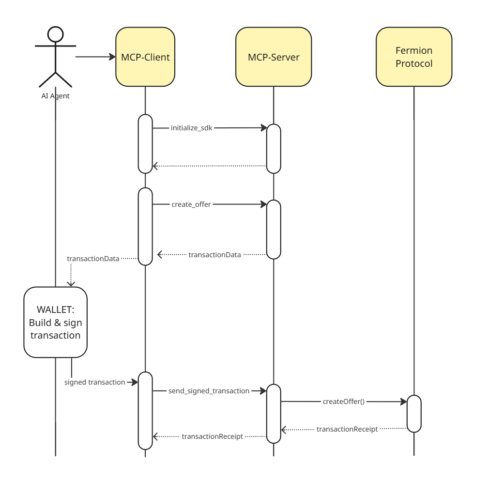

# Interact with the High Value Asset Module

> **Note:** "Fermion" is no longer used as a brand. The former Fermion Protocol was integrated into the Boson codebase in 2025 and is now the **High Value Asset Module** of Boson Protocol. The `fermion` directory and file names, service names (`fermion-mcp-server`, `fermion-protocol-node`, `fermion-subgraph`), Docker images, and SDK package names are retained at the code level for compatibility.

The following documentation illustrates how an AI Agent can interact with the module.

## Prerequisites

Make sure you have:
- a functional Local Environment running (see [setup-local-env](./setup-local-env.md))
- a functional MCP Client implementation connecting to the High Value Asset Module MCP Server on this local environment (see [create-mcp-client](./create-mcp-client.md))
- identified a pre-funded wallet private key your AI Agent will use:
  The mcp-client needs to manage the wallet that will identify the Seller entity on the blockchain.
  As the following example will run on the Local Environment, the wallet/privateKey we're going to use for our agent is one of the pre-funded wallets in the [Local Environment](./setup-local-env.md).
- a basic understanding on web3 concepts, including signing a transaction with your wallet (for instance using [ethers.js](https://docs.ethers.org/v5/api/signer/))

In addition:
- as the MCP server doesn't support entity creation yet, creating a seller entity for your AI Agent needs to be done in advance. An easy way to do it is using the module's Core-SDK (published as `@fermionprotocol/core-sdk` for code-compatibility reasons) in a javascript/typescript script, as described in [./example/seller-entity-creation.ts](./example/seller-entity-creation.ts)
- the ERC20 token used as the exchange token for the offers to be created also needs to be registered on the protocol.

NOTE: Make sure you are creating the seller entity with the same wallet that you're planning to use in the following steps.

## General Mechanisms

The AI Agent is supposed to manage their own web3 wallet. This means the AI Agent will be in charge of signing the transaction data returned by the MCP Server when the tools are used.

An example of how to implement signing a transaction data is given in [../../scripts/sign-transaction.ts](../../scripts/sign-transaction.ts).

Once the signed transaction has been built by the AI Agent, the MCP Server provides the tool called "send_signed_transaction" to submit it to the blockchain. See example below for details about how to use the "send_signed_transaction" tool.

## Creating an Offer

To create an offer, the MCP server provides a tool called "create_offer", which returns the transaction data that needs to be signed by the web3 wallet before being submitted to the blockchain.

The following example shows the complete flow the AI Agent should implement to:
- create the transaction data to create an offer ("create_offer" tool)
- sign the transaction locally with the AI Agent's wallet (see [../../scripts/sign-transaction.ts](../../scripts/sign-transaction.ts) for an ethers-based example)
- submit the transaction to the blockchain ("send_signed_transaction" tool).

