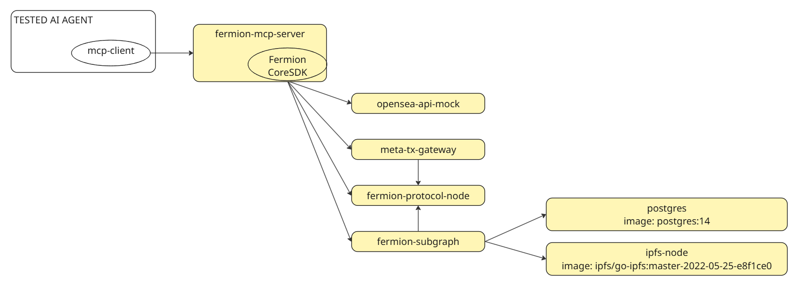

# Setup Local Environment for the High Value Asset Module Core Components

> **Note:** "Fermion" is no longer used as a brand. The former Fermion Protocol was integrated into the Boson codebase in 2025 and is now the **High Value Asset Module** of Boson Protocol. Service names (`fermion-protocol-node`, `fermion-mcp-server`, `fermion-subgraph`), Docker image names (`ghcr.io/fermionprotocol/*`, `ghcr.io/bosonprotocol/mcp-server/fermion-mcp-server`, etc.), SDK package names (`@fermionprotocol/core-sdk`), and the `local-31337-0` configId are retained below for code-level compatibility.

The local environment runs a set of Docker containers to provide a complete runtime environment for the High Value Asset Module and its core components, including the module's MCP server.

Unlike a staging environment on a public testnet blockchain (where the module is also deployed), the local environment can be used for automated testing, as the blockchain state and all data created during testing are reset each time the containers are restarted.



## Prerequisites

Make sure you have:
- [Installed the latest version of Docker Compose](https://docs.docker.com/compose/install/)
- A basic understanding of Docker concepts and how Docker works

## Docker Compose Specification

The local environment defines a set of services, each run as a container using Docker Compose.
The configuration follows the module's Core-SDK default setup (published as `@fermionprotocol/core-sdk`) for the *local-31337-0* config, which is intended for use in this local containerized environment (please refer to the SDK documentation for more details).

[see docker-compose example](./example/docker-compose.yaml)

### Services

#### fermion-protocol-node

The *fermion-protocol-node* service runs a local blockchain node, with all the smart contracts required to operate the High Value Asset Module.

This blockchain is pre-initialized with [a set pre-funded of Wallets](https://github.com/fermionprotocol/contracts/blob/main/e2e/accounts.ts) that can be used in order to send transactions (and pay for the transaction fees).
However, you can also use other Wallets/Private Keys in your tests after you have transferred them enough funds from some pre-funded wallets to manage the transaction fees.

The defined chainId is 31337, as stated in [this configuration file](https://github.com/fermionprotocol/contracts/blob/main/e2e/hardhat.config-node.ts), in accordance with the module Core-SDK's default configuration for the *local-31337-0* config.

Contracts for the High Value Asset Module, the core Boson Protocol, and additional components (ERC20 token, Forwarder, Seaport) are deployed at addresses consistent with the module Core-SDK's default configuration for the *local-31337-0* config.

Docker images:
- ghcr.io/fermionprotocol/contracts/fermion-protocol-node:main
- fermionprotocol/fermion-protocol-node:main

Dependencies:
None

Configuration (see ./example/docker-compose.yaml for complete technical details):
- export PORT 8545

The RPC Node (URL used by client/tools to interact with the blockchain) is defined to be http://localhost:8545 (in accordance with the module Core-SDK default configuration for *local-31337-0* config).

#### fermion-mcp-server

The *fermion-mcp-server* service is the MCP Server for the High Value Asset Module.

Docker images:
- ghcr.io/bosonprotocol/mcp-server/fermion-mcp-server:main
- bosonprotocol/fermion-mcp-server:main

Dependencies:
- the mcp-server is connecting to the blockchain node (= *fermion-protocol-node* service)
- the mcp-server is connecting to the IPFS node (= *ipfs* service)

Configuration (see ./example/docker-compose.yaml for complete technical details):
- export PORT 3000
- define connections with *ipfs* and *fermion-protocol-node* services

#### fermion-subgraph

The *fermion-subgraph* service provides an instance of [graph node](https://thegraph.com/docs/en/indexing/tooling/graph-node/) and publishes the subgraph used to index blockchain data about the High Value Asset Module, to structure it and to serve it to clients via a GraphQL API.

Docker images:
- ghcr.io/fermionprotocol/core-components/fermion-subgraph:main
- fermionprotocol/fermion-subgraph:main

Dependencies:
- the graph node needs a *postgres* service running in the background
- the graph node needs an *ipfs* service to access the metadata files linked with the on-chain events
- the graph node is connecting to the blockchain node (= *fermion-protocol-node* service)

Configuration (see ./example/docker-compose.yaml for complete technical details):
- export PORTS 8000,8001,8020,8030,8040
- define connections with *postgres*, *ipfs* and *fermion-protocol-node* services

The built subgraph can be explored locally at http://localhost:8000/subgraphs/name/fermion/corecomponents, in accordance with the module Core-SDK's default configuration for the *local-31337-0* config. It allows manual monitoring of all user interactions with the High Value Asset Module.

#### postgres

The *postgres* database is required by the graph node run with the *fermion-subgraph* service.

Docker image:
- postgres:14

Configuration:
- export PORT 5432
- user/password matching the configuration given to the *fermion-subgraph* service.

#### ipfs

The *ipfs* service is required to host the metadata files used to describe the module's entities and offers. This IPFS node should be accessed by the *fermion-subgraph* service so that it can read the metadata file contents and populate data in the subgraph.

Docker image:
- ipfs/go-ipfs:master-2022-05-25-e8f1ce0

Configuration:
- export PORTS 5001,8080
- a volume is defined to set the appropriate configuration flags to the node

#### meta-tx-gateway

The *meta-tx-gateway* service is used by the module Core-SDK to relay meta-transactions to the High Value Asset Module on-chain.

Meta-transactions are an optional feature supported by the module, allowing transactions to be relayed to the protocol contracts instead of being sent directly by the end-user wallet. This is especially useful for sponsoring transaction fees, so that end-users don't need to have native funds (e.g., ETH on Ethereum) in their wallets.

For more details: [Meta-transactions Concepts](https://docs.polygon.technology/pos/concepts/transactions/meta-transactions/), [EIP-2771](https://eips.ethereum.org/EIPS/eip-2771)

Docker images:
- ghcr.io/bosonprotocol/meta-tx-gateway:main
- bosonprotocol/meta-tx-gateway:main

Configuration (see ./example/docker-compose.yaml for complete technical details):
- export PORT 8888
- the PRIVATE_KEY of one of the pre-founded wallets is provided to effectively send the transactions on-chain

Meta-transaction relayer URL is defined to be http://localhost:8888 (in accordance with module Core-SDK default configuration for *local-31337-0* config)

#### opensea-api-mock

The *opensea-api-mock* service allows the module Core-SDK to rely on a few services provided by [Opensea API](https://docs.opensea.io/reference/openapi-definition) on public networks, and accessed through [opensea-sdk](https://github.com/ProjectOpenSea/opensea-js).

Mocked endpoints are:
- GET /api/v2/chain/:chain/payment_token/:token
- GET /api/v2/collections/:slug
- GET /api/v2/chain/:chain/contract/:assetContractAddress/nfts/:tokenId
- GET /api/v2/orders/:chain/:protocol/:sidePath
- POST /api/v2/orders/:chain/:protocol/:sidePath
- POST /api/v2/:sidePath/fulfillment_data

## Run the Local Environment

Copy all files from [./example](./example) in your project

Run a terminal and move to the folder which contains the files copied from [./example](./example) (= where the docker-compose.yaml is).

- Launch Docker Compose configuration

  ```shell
  docker compose up -d

  ```

-Now you need to wait for everything to be ready (in particular, for all contracts to be deployed in the *fermion-protocol-node* service).

  ```shell
  docker compose exec fermion-protocol-node ls /app/deploy.done
  while [ $? -ne 0 ]; do
    sleep 15
    echo "Waiting for contracts to be deployed..."
    docker compose exec fermion-protocol-node ls /app/deploy.done
  done
  ```

  The */app/deploy.done* file is created on the *fermion-protocol-node* when everything is ready. It usually takes a few minutes.

## Create an MCP Client

Once the environment is ready, any AI Agent can connect to the MCP server to interact with the High Value Asset Module by implementing an MCP client.

See [create-mcp-client](./create-mcp-client.md) for details about how to implement an MCP Client and connect to the module's MCP Server.

If you already have connected your MCP Client to the module's MCP Server, you can [interact with the High Value Asset Module](./interact-with-fermion-protocol.md).

## Stop the Local Environment

To stop the containers, run
```shell
docker compose down -v
```

Note: the *-v, --volumes* option is required to drop the Postgres database, to ensure the subgraph will get a clean environment on the next start.

